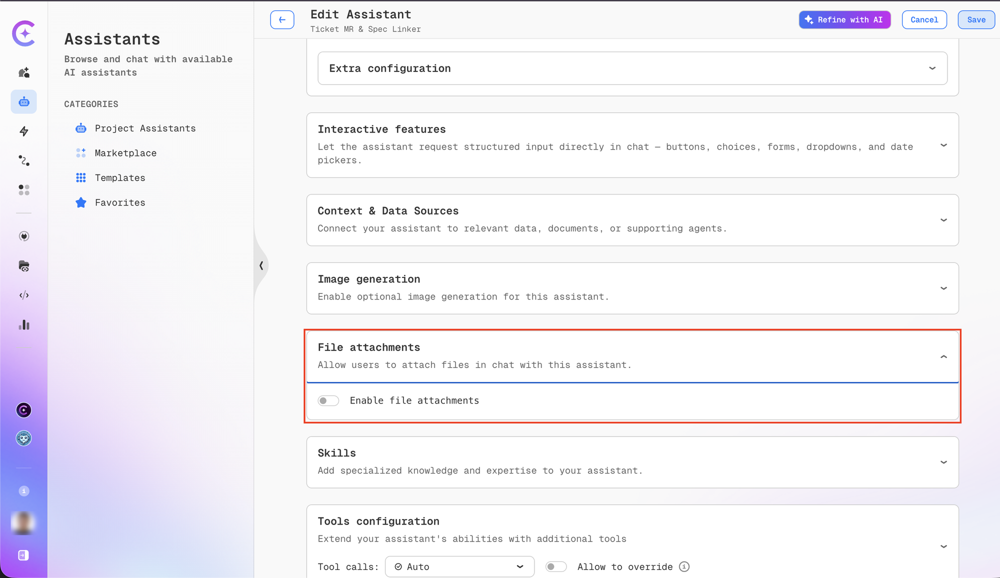

# Create Assistant

Create custom assistants tailored to your specific needs. We recommend starting with assistant templates to familiarize yourself with the platform before building custom assistants.

## Creating an Assistant

You can create an assistant in two ways: manually or using AI generation.

import Tabs from '@theme/Tabs';
import TabItem from '@theme/TabItem';

<Tabs>
<TabItem value="ai" label="Generate with AI" default>

You can create an assistant using AI generation, which automatically configures the assistant based on your requirements.

1. Navigate to the **Assistants** section.

2. Click **+ Create Assistant** in the Project Assistants menu.

3. In the **Generate Assistant with AI** popup, describe your main idea and requirements for the assistant.

4. If you enable the **Include tools** toggle, the platform recommends features and tools that fit the assistant's goals.

   

5. After clicking the **Generate with AI** button, the AI will configure the assistant for you—including its name, description, conversation starters, and system instructions.

:::info AI-Powered Configuration
Generate with AI analyzes your requirements and automatically sets up the assistant with appropriate configuration, saving time on initial setup and ensuring best practices.
:::

</TabItem>

<TabItem value="manual" label="Manual Creation">

1. Navigate to the **Assistants** section.

2. Click **+ Create Assistant** in the Project Assistants menu:

   

3. Configure the assistant properties:

   

**Configuration Fields**

| Field                              | Description                                                                |
| ---------------------------------- | -------------------------------------------------------------------------- |
| **Project**                        | The project where the assistant will be created                            |
| **Shared with Project**            | Enable to allow team members to view and use the assistant                 |
| **Name**                           | Descriptive name for the assistant                                         |
| **Slug**                           | Unique human-readable identifier for sharing (e.g., `my-custom-assistant`) |
| **Description**                    | Brief description of the assistant's purpose and capabilities              |
| **System Instructions**            | Core prompt that defines the assistant's behavior and responses            |
| **Icon URL** (Optional)            | URL to an image for the assistant's avatar                                 |
| **Data Source Context** (Optional) | Project documentation or Git repository for context                        |
| **Available Tools**                | Tools and integrations to extend the assistant's capabilities              |

**Slug Configuration**

The slug creates a unique URL for sharing your assistant:


:::tip
Only fill in the slug field if you plan to share the assistant with others.
:::

**Variables**

Use variables in system instructions to create dynamic prompts:

**Static Variables:**

- **Current User**: The email address of the current user
- **Date**: Current date and time

Click on a variable to insert it into your System Instructions.

**Dynamic Variables:**

Use the **Manage Prompt Vars** button to create custom dynamic variables for your specific use case.

:::note
When you share an assistant with your project, all team members can set their own values for prompt variables without affecting each other or the assistant's defaults. See [Personalizing Prompt Variables](./sharing-assistants.md#personalizing-prompt-variables).
:::

**Managing Sensitive Prompt Variables**

Sensitive prompt variables allow you to securely store credentials, API keys, passwords, and other confidential information that your assistant needs. These variables are encrypted and masked in the UI to protect sensitive data.

**Key Features:**

- **Encryption**: Sensitive variable values are encrypted for security
- **Masking**: Values are displayed as `**********` in the UI
- **Shield Icon**: Visual indicator for sensitive fields with "Encrypted credential" tooltip
- **User-specific Values**: Each user can have their own values for sensitive variables
- **Thread Safety**: Values are isolated between concurrent requests

**Configuration:**

1. Click **Manage Prompt Vars** button in the System Instructions section:

   

2. In the Variables table, configure your prompt variables:
   - **Key**: Variable name (used as `{{your_variable}}` in system instructions)
   - **Default Value**: The value to use (will be masked if marked as sensitive)
   - **Description**: Optional explanation of the variable's purpose
   - **Sensitive**: Check this box to mark the variable as sensitive

   To edit the sensitive status of an existing variable:
   - Click the **pencil icon** (edit) next to the variable
   - Check or uncheck the **Sensitive** checkbox
   - Click the **checkmark icon** to apply changes
   - Click **Save** button in the dialog to save all changes
   - Click **Save** button in the assistant window to finalize

   

3. When editing a variable, you'll see the shield icon next to sensitive fields:

   

**Use Cases:**

- **API Credentials**: Store API keys for external services (e.g., `{{API_KEY}}`)
- **Authentication Tokens**: Manage access tokens securely (e.g., `{{ACCESS_TOKEN}}`)
- **Database Passwords**: Store database credentials (e.g., `{{DB_PASSWORD}}`)
- **Service Accounts**: Manage service account credentials
- **Custom Fields**: Any sensitive data specific to your workflow (e.g., `{{JIRA_TOKEN}}`)

**Example Usage in System Instructions:**

```
You are a DevOps assistant with access to infrastructure tools.

Use the following credentials when needed:
- API Key: {{API_KEY}}
- Database Password: {{DB_PASSWORD}}
- Service Token: {{SERVICE_TOKEN}}

Always use these credentials securely and never expose them in responses.
```

:::warning Important

- Sensitive variables are marked with a shield icon in the UI
- Values are encrypted and only decrypted when needed by the assistant
- Each user can override sensitive variable values with their own credentials
- Backward compatibility is maintained - variables without the sensitive flag default to non-sensitive
- **Once a variable is marked as sensitive and saved, the value cannot be recovered if you uncheck the sensitive flag** - it will remain masked as `**********`. You will need to re-enter the value if you want to convert it back to a regular variable.
  :::

</TabItem>
</Tabs>

## Tools Configuration

Select tools to extend your assistant's capabilities:


:::warning Performance Consideration
Each tool requires additional computing power, which may increase response time. Select only the tools your assistant needs.
:::

:::info Integration Required
Most tools require prior integration setup before they can be used. When you save the
assistant, the platform automatically validates that all required integrations are
configured. If any are missing, a **Missing Integrations** modal appears with options to
add them or skip validation. See [Integration Validation During Assistant Save](../tools_integrations/integrations/index.md#integration-validation-during-assistant-save).
:::

## Limit Tool Output Tokens

Large tool outputs — a full file read, a long API response, or a wide search result — can
consume a significant share of the model's context window. The **Limit Tool Output Tokens**
setting caps, per assistant, how many tokens a single tool's output may contribute to the
conversation.

The setting is located in the assistant configuration form, inside the **Extra configuration**
section, alongside **LLM model**, **Temperature**, and **Top P**.


**Behavior**

- When the field is left empty, each tool applies its own built-in output limit. This is the
  default behavior.
- When a value is set, it acts as a single, assistant-wide cap that overrides every tool's
  individual default, including per-MCP-server limits. Tool outputs larger than the limit are
  truncated before they reach the model.

**Field rules**

| Property       | Behavior                                                               |
| -------------- | ---------------------------------------------------------------------- |
| Default state  | Empty — no assistant-specific limit is applied                         |
| Accepted input | Positive whole numbers only                                            |
| Placeholder    | `30000` is shown as a hint only; it does not set a value automatically |
| Persistence    | A saved value is retained and shown again when the assistant is edited |

:::tip
Lower the limit for an assistant that calls tools returning very large payloads, to preserve
context space for reasoning. Raise it — or leave it empty — when the full tool output is needed
for accurate answers.
:::

:::note
The `30000` placeholder is a visual hint only. Until a value is entered and saved, the assistant
continues to use each tool's own default limit.
:::

## File Attachments

The **File attachments** section controls whether users can attach files when chatting with
the assistant.



The section contains a single **Enable file attachments** toggle:

| State        | Behavior                                                                                 |
| ------------ | ---------------------------------------------------------------------------------------- |
| **Enabled**  | The paperclip icon appears in the chat input toolbar; users can attach files to messages |
| **Disabled** | The paperclip icon is hidden; file uploads are not available for this assistant          |

:::info
File attachments are enabled by default for new assistants. Disable this setting when the
assistant's use case does not involve file analysis, or when file uploads should be
restricted for compliance or security reasons.
:::

## Managing Your Assistant

4. Once created, your assistant appears in the **My Assistants** menu:

   

5. Use the action menu to manage your assistant:

   

   Available actions:
   - **Edit**: Modify assistant configuration
   - **Delete**: Remove the assistant
   - **Clone**: Create a copy
   - **Publish to Marketplace**: Share with the community
   - **Copy Link**: Get shareable URL
   - **View Details**: See full configuration

6. Click the **Chat** icon to start a conversation. The assistant will also appear in the quick Assistants list for easy access.
